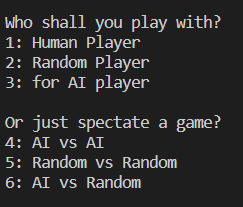
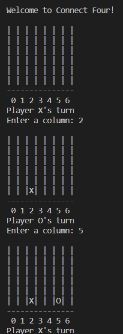
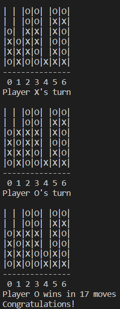

# Connect-Four:


Recreated the classic Connect-Four game with fun and interactive modes that you can play/spectate. In this version of Connect-Four, you have an option to go against a "Random" player, who is coded with randomness to place checkers on the board with no specific strategy. Or, go up against an "Artificial Intelligence" player who is coded to put a checker based on the future prediction looking ahead of it's next move to determine where it's best to put the checker with a high winning percentage. Or, you can just sit back and enjoy the competition between a "Random" player vs another "Random Player, AI against AI, etc. Or if you're just looking to have a fun time challenger your friend or AI, you can play against other as well!

# Instructions:

To run this game, make sure to clone this repository first! Then you can run this game with the instruction above on your terminal"

```python full_game.py```

### You're free to customize the players/checkers you want to play with by simply running the python script in full_game.py to view the options of the game you want to play or spectate. To place a checker in, simply type a column number in.

### Here is a screenshot of how the Graphical User Interface looks like:


### Here is a screenshot of how a game would be played interactively vs a Player or a Non Human Player:


### Here is a screen of how a game is played with 2 non human players:

